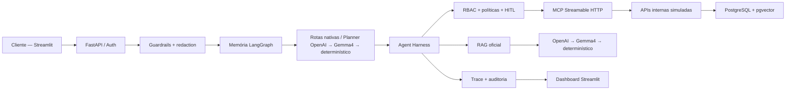

# Intelligent Banking Agent — Itaú

Assistente bancário agentic executável localmente, com chat Streamlit, orquestração LangGraph,
OpenAI com fallback local, RAG oficial em PostgreSQL/pgvector, MCP para sistemas internos, RBAC,
confirmação humana e auditoria imutável.

> Projeto demonstrativo: operações e identidades são simuladas. As fontes documentais são oficiais,
> mas esta aplicação não se conecta a contas bancárias reais.

## O que a solução demonstra

- conversa em português com memória estruturada por sessão;
- rotas nativas para comandos bancários explícitos, social, confirmações e continuações estruturadas, com planner LLM para intenções ambíguas;
- respostas de tarifas, investimentos, consignado e políticas baseadas somente na KB ingerida;
- consultas de saldo, perfil e limite por um gateway MCP real;
- Pix e alteração de limite executados por MCP somente depois de RBAC, políticas e HITL;
- guardrails e redaction antes de qualquer chamada de modelo;
- auditoria crítica append-only no PostgreSQL, com hash encadeado e idempotência;
- dashboard técnico com jornada dinâmica, RAG, LLM, MCP, HITL, latências e auditoria.

## Arquitetura



O modelo sugere rota ou sintetiza texto grounded. Identidade, autorização, políticas, confirmação,
execução de ferramentas e auditoria permanecem em código nativo.

## Fluxos principais

### Consulta documental

1. Guardrails validam e redigem a mensagem.
2. O roteador identifica conteúdo documental.
3. O MCP aciona `search_tariff_knowledge`.
4. PostgreSQL combina busca textual e pgvector.
5. A resposta usa apenas fatos publicados e fontes oficiais ingeridas.
6. OpenAI `gpt-5.4` sintetiza quando necessário; `gemma4:latest` e o builder determinístico são fallbacks.

### Pix e alteração de limite

1. A API deriva a identidade do token confiável.
2. O Harness aplica RBAC e políticas.
3. Operações críticas são pausadas em um checkpoint.
4. O cliente escolhe **Autorizar** ou **Não autorizar** no chat.
5. Somente após autorização o MCP executa `create_pix` ou `update_card_limit`.
6. O ciclo completo fica registrado na auditoria e no dashboard.

## Componentes

| Componente | Responsabilidade |
|---|---|
| `app/api` | Canais de entrada e adapters internos protegidos |
| `app/services/harness.py` | Guardrails, RBAC, políticas, HITL e despacho |
| `app/graph` | LangGraph e memória conversacional estruturada |
| `app/mcp/server.py` | Servidor MCP Streamable HTTP |
| `app/services/internal_systems.py` | Gateway MCP/local para sistemas internos |
| `app/services/knowledge` | Ingestão, retrieval, reranking e respostas grounded |
| `prompts/banking-v1` | Prompts versionados em inglês, com saída obrigatória em pt-BR |
| `frontend/customer_chat.py` | Chat do cliente e decisões HITL |
| `frontend/ops_dashboard.py` | Jornada, traces, fontes, métricas e auditoria |
| `knowledge` | Catálogo versionado usado na ingestão idempotente |

### Estrutura do projeto

```text
app/
├── api/          APIs de entrada e adapters internos protegidos
├── graph/        LangGraph e memória conversacional
├── mcp/          servidor MCP Streamable HTTP
├── security/     identidade, RBAC, guardrails e credenciais internas
└── services/     Harness, RAG, ferramentas, auditoria e providers
frontend/         chat do cliente e dashboard operacional
knowledge/        catálogo estruturado para ingestão idempotente
prompts/          prompts externos, versionados por perfil
scripts/          ingestão e smokes operacionais
tests/            validação determinística do backend e dashboard
docs/             arquitetura e roteiro público de demonstração
```

## Execução com Docker

### Requisitos

- Docker Desktop com Compose;
- portas `8000`, `8501`, `8502`, `8600` e `5432` livres;
- chave OpenAI opcional no `.env`;
- Docker Model Runner com `gemma4:latest` opcional para fallback local.

### Configuração

```powershell
Copy-Item .env.example .env
```

Preencha somente o `.env`. Nunca coloque credenciais reais no `.env.example`.

```dotenv
OPENAI_API_KEY=sua-chave
LLM_PROVIDER=openai
LLM_FALLBACK_PROVIDER=docker_model_runner
LLM_MODEL=gpt-5.4
DOCKER_MODEL_RUNNER_MODEL=gemma4:latest
```

### Subir a aplicação

```powershell
docker compose up --build -d
docker compose ps
```

Interfaces:

- Chat: <http://localhost:8501>
- Dashboard: <http://localhost:8502>
- API/OpenAPI: <http://localhost:8000/docs>
- MCP Streamable HTTP: `http://localhost:8600/mcp`

O endpoint MCP não deve ser validado com um `GET` comum. Use o cliente protocol-aware:

```powershell
docker compose exec api python scripts/smoke_mcp_client.py --url http://mcp-server:8600/mcp
```

## Perfis e massas de demonstração

| Perfil | Cliente | Capacidades |
|---|---|---|
| Cliente | `123` — Fabio de Melo | Leitura e operações na própria conta |
| Gerente | Cliente-alvo informado | Leitura de clientes, sem escrita |
| Administrador | Cliente-alvo informado | Leitura e escrita autorizadas |

Outro cliente disponível: `456` — Gerardo da Silva. O score de crédito existe no payload técnico e
na política determinística de limite, mas não é enviado ao planner nem revelado na resposta ao cliente.

## Knowledge Base

A aplicação não consulta a web durante o atendimento. O conteúdo oficial é ingerido previamente:

- `.docs/tabela_geral_de_tarifas_pf_pdf.pdf`;
- snapshots curados da Central de Atendimento, Investimentos, Políticas e Consignado INSS.

Principais tabelas:

- `knowledge_sources`, `knowledge_pages`, `knowledge_sections`;
- `knowledge_chunks` com embedding pgvector;
- `knowledge_facts` e `fact_evidence`;
- `tariff_entries`, `tariff_rules`, `tariff_entry_rules`;
- `service_packages` e `package_items`;
- `critical_audit_events`.

Valores monetários vêm das tabelas estruturadas publicadas; chunks semânticos ajudam a localizar e
explicar regras, mas não são autoridade para inventar preços.

### DBeaver

Use uma conexão PostgreSQL:

| Campo | Valor padrão |
|---|---|
| Host | `localhost` |
| Porta | `5432` |
| Database | `itau_agent` |
| Usuário | `itau` |
| Senha | `itau` |

As credenciais são locais e podem ser alteradas no Compose para outro ambiente.

## Modelos e prompts

O roteamento é configurado por `.env`, sem alterações no código:

- planner de intenções ambíguas: OpenAI `gpt-5.4` → `gemma4:latest` → roteador determinístico;
- síntese documental: OpenAI `gpt-5.4` → `gemma4:latest` → resposta grounded determinística;
- comandos explícitos de saldo, Pix, limite e emergência, além de social, segurança e side effects,
  não dependem de LLM.

Os prompts ficam fora do código em `prompts/<perfil>/`. O trace registra perfil, versão e hash do
prompt, permitindo atualização e auditoria sem acoplar instruções aos nós.

### Teste explícito do Gemma

No modo normal, o Gemma é fallback do **planner de intenções ambíguas** e da **síntese documental**
quando a OpenAI falha.
Para demonstrá-lo de forma previsível sem editar `.env` ou reiniciar containers, selecione
**Gemma4 local — demonstração** na lateral do chat. A escolha passa a valer tanto para o planner
quanto para o RAG. Faça uma pergunta documental ou ambígua e confira no dashboard
`provider=docker-model-runner` e `model=gemma4:latest`. Comandos explícitos de saldo, Pix, limite,
emergência e saudações permanecem nas rotas nativas e não chamam LLM. O passo a passo completo está no
[blueprint AWS](docs/ARQUITETURA_AWS.md#teste-local-do-gemma-sem-alterar-código).

A primeira inferência local pode ser mais lenta por causa do carregamento do modelo. O timeout do
Docker Model Runner é independente (`DOCKER_MODEL_RUNNER_TIMEOUT_SECONDS`, padrão `60`) para não
alterar o limite mais curto usado pelo provider principal. O chat aguarda até
`CHAT_REQUEST_TIMEOUT_SECONDS` (padrão `90`), cobrindo o failover sem abandonar a resposta local
antes do timeout do provider.

## Decisões arquiteturais e trade-offs

| Decisão | Benefício | Custo ou limitação |
|---|---|---|
| Harness nativo como autoridade | LLM não controla identidade, dinheiro ou políticas | Mais contratos e código de orquestração |
| PostgreSQL + pgvector | Une catálogo, vetores e auditoria na entrega local | Escala de busca menor que um cluster especializado |
| MCP como gateway interno | Ferramentas padronizadas e desacopladas do planner | Um salto adicional de rede e observabilidade |
| OpenAI com Gemma e builder determinístico | Qualidade com degradação controlada | Fallback local exige memória e pode ter maior latência |
| Memória estruturada | Resolve referências sem guardar conversa bruta | `InMemorySaver` local não sobrevive ao restart |
| Catálogo de tarifas estruturado | Valores financeiros exatos e auditáveis | Ingestão exige reconciliação e publicação controlada |

Detalhes e alternativas estão em [Arquitetura e decisões técnicas](docs/ARQUITETURA.md). A evolução
gerenciada está em [Blueprint de produção na AWS](docs/ARQUITETURA_AWS.md).

## Segurança e governança

- token confiável define identidade, papel e scopes;
- o campo `role` enviado pelo frontend não concede permissão;
- segredos, CVV, iToken e cartão completo são bloqueados antes da LLM;
- chamadas MCP recebem credencial apenas no contexto nativo, nunca no prompt ou trace;
- Pix e limite exigem checkpoint/HITL conforme política;
- auditoria crítica rejeita `UPDATE` e `DELETE` e permite verificar a cadeia de hashes.

O login local é um adapter de demonstração. Em produção, a evolução recomendada é OIDC/OAuth2 com
PKCE e JWT validado no servidor, secrets manager e exportação de auditoria para WORM/SIEM.

## Testes

Local:

```powershell
.venv\Scripts\python.exe -m pytest -q
```

No container:

```powershell
docker compose exec -e INTERNAL_SYSTEMS_TRANSPORT=local `
  -e LLM_GROUNDED_FAQ_ENABLED=false `
  -e AGENTIC_PLANNER_ENABLED=false api pytest -q
```

A suíte cobre RAG, tarifas estruturadas, RBAC, spoofing, guardrails, memória, Pix, limite, HITL,
cancelamento, auditoria, MCP e componentes do dashboard. O GitHub Actions instala Python 3.13,
executa `pytest -q` e constrói a imagem Docker.

## Observabilidade

O dashboard atualiza automaticamente e mostra:

- jornada da solicitação;
- rota e planner;
- guardrails, RBAC e HITL;
- ferramentas MCP;
- fontes e contexto aprovado do RAG;
- provider, modelo, tokens e fallback;
- latência de frontend, API, roteamento, retrieval, provider e composição;
- últimos eventos críticos e integridade da auditoria.

LangSmith é opcional e controlado por `LANGSMITH_TRACING` e `LANGSMITH_API_KEY`.

## Limitações e próximos passos

### Limitações conhecidas

- memória conversacional LangGraph usa `InMemorySaver` e reinicia com o processo;
- operações e identidade são mocks locais;
- não há integração bancária, OIDC ou implantação AWS real;
- traces técnicos em memória não sobrevivem ao restart da API;
- a auditoria local em PostgreSQL não substitui WORM/SIEM de produção.

### Próximos passos de produção

1. Substituir o login de demonstração por Cognito/OIDC com PKCE e JWT validado no servidor.
2. Persistir memória LangGraph e traces em PostgreSQL compartilhado.
3. Implantar API/Harness e MCP em rede privada, com Secrets Manager e KMS.
4. Adotar Bedrock como provider gerenciado e manter Gemma privado como fallback controlado.
5. Exportar auditoria para armazenamento WORM/SIEM e configurar alertas operacionais.
6. Executar testes de carga, segurança, recuperação e qualidade do RAG antes de produção.

## Documentação complementar

- [Arquitetura e decisões técnicas](docs/ARQUITETURA.md)
- [Blueprint de produção na AWS](docs/ARQUITETURA_AWS.md)
- [Guia público de demonstração](docs/GUIA_DEMO.md)
