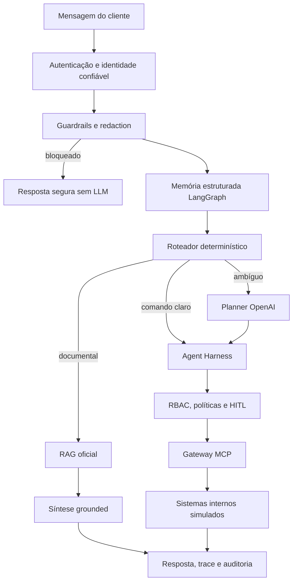

# Arquitetura e decisões técnicas

Este documento consolida as decisões vigentes do Intelligent Banking Agent. O histórico de trabalho
e alternativas intermediárias não faz parte da documentação pública.

## Princípios

1. Segurança, identidade, estado crítico e execução ficam fora da LLM.
2. O modelo recebe somente contexto redigido e aprovado.
3. Toda operação crítica passa por RBAC, política, HITL e auditoria.
4. Respostas documentais usam apenas fontes oficiais previamente ingeridas.
5. Falha de provider degrada a experiência, não a segurança.

## Fluxo de execução

## Decisões consolidadas

### Agent Harness como autoridade

O planner pode selecionar uma capability registrada, mas não executa ferramentas. O Harness valida
escopo, cliente-alvo, dados obrigatórios, limites, checkpoint e confirmação antes do side effect.

### Guardrails antes de modelos e ferramentas

Senha, CVV, iToken e cartão completo são bloqueados na entrada. Dados permitidos são redigidos antes
do planner ou sintetizador. Tokens confiáveis permanecem em contexto nativo e não entram em prompt,
checkpoint conversacional ou trace.

### Memória LangGraph estruturada

O checkpointer usa `session_id` e guarda sinais mínimos, como `current_topic=card_limit`. Isso resolve
referências omitidas sem persistir a mensagem bruta. Checkpoints de Pix/limite são separados porque
representam operações críticas. A versão local usa memória de processo; produção deve usar um
checkpointer PostgreSQL compartilhado.

### Roteamento de modelos

- Planner: OpenAI `gpt-5.4` e fallback determinístico.
- Síntese documental: OpenAI `gpt-5.4`, `gemma4:latest` e builder grounded determinístico.
- Social, guardrails, RBAC, políticas, HITL e execução não dependem de LLM.

Prompts são externos e versionados em `prompts/banking-v1`, escritos em inglês e configurados para
responder ao cliente em pt-BR.

### MCP como gateway real

O Agent Harness usa um cliente MCP Streamable HTTP para consultar perfil, saldo, limite e KB, além de
executar alteração de limite e Pix. As APIs FastAPI simulam sistemas internos downstream. Tools de
escrita são de baixo nível e não reenviam a solicitação ao chat, evitando recursão.

### RAG híbrido e catálogo estruturado

PostgreSQL/pgvector substitui as opções exemplificadas no desafio com a mesma função de retrieval.
Busca textual e vetorial localizam contexto; valores financeiros vêm de fatos/tarifas estruturados,
publicados e ligados à evidência oficial. Não existe consulta web durante o atendimento.

### HITL

Pix acima do limiar e aumento de limite criam checkpoint. **Autorizar** retoma a operação;
**Não autorizar** consome o checkpoint sem executar a tool. Os dois caminhos são auditados.

### Auditoria

Eventos críticos são append-only em PostgreSQL, com ator, papel, alvo, sessão, status, payload
redigido, idempotência, hash anterior e hash atual. Trigger rejeita alteração/exclusão. Produção deve
exportar a cadeia para WORM/SIEM.

## Evolução para produção

- OIDC/OAuth2 Authorization Code com PKCE e JWT validado no servidor;
- secrets manager e rotação de credenciais;
- PostgreSQL checkpointer para memória conversacional e traces duráveis;
- filas e workers para integrações lentas;
- WORM/SIEM para auditoria;
- métricas, alertas, rate limiting e circuit breaker de providers;
- implantação AWS com serviços gerenciados, mantendo o Harness independente do modelo.
