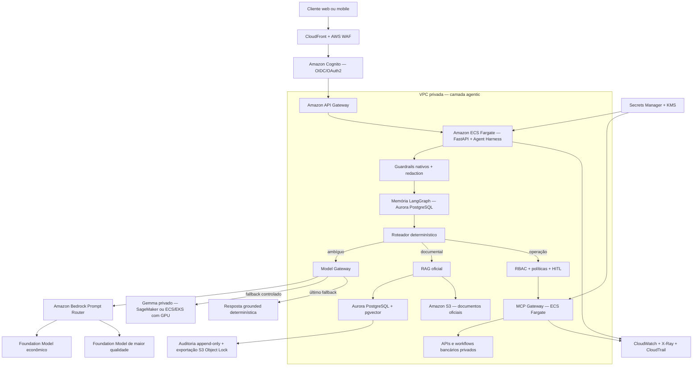

# Blueprint de produção na AWS

Este documento descreve uma evolução de produção para a solução local. Ele é um blueprint
arquitetural e não afirma que os recursos AWS estejam implantados.

## Visão geral



## Responsabilidades

- **CloudFront e WAF:** proteção de borda, TLS, rate limiting e regras contra abuso.
- **Cognito:** identidade confiável; cliente, papel e scopes não vêm do texto enviado ao agente.
- **ECS Fargate:** executa a API e o Agent Harness sem acoplar segurança ao modelo.
- **Roteador determinístico:** resolve social, comandos claros, bloqueios e rotas sensíveis sem LLM.
- **Model Gateway:** seleciona provider por política, disponibilidade, custo e tipo de solicitação.
- **Amazon Bedrock:** oferece inferência gerenciada e, quando aplicável, prompt routing dentro de uma
  família de modelos.
- **Gemma privado:** preserva o diferencial de fallback local/self-hosted quando Bedrock ou outro
  provider estiver indisponível.
- **MCP Gateway:** único caminho do Harness para ferramentas e sistemas bancários internos.
- **Aurora PostgreSQL/pgvector:** mantém catálogo estruturado, vetores, memória durável e auditoria.
- **S3:** origem versionada de PDFs e páginas oficiais ingeridas; não há navegação web no atendimento.
- **CloudWatch, X-Ray e CloudTrail:** métricas, traces técnicos e eventos administrativos.

## Roteamento de modelos

O roteamento deve permanecer em duas camadas:

1. O roteador determinístico decide se a solicitação sequer precisa de modelo.
2. O Model Gateway escolhe Bedrock, Gemma ou resposta determinística para os casos que precisam.

O Intelligent Prompt Routing do Bedrock pode otimizar custo e qualidade entre modelos compatíveis da
mesma família. Como ele possui restrições de modelos e é otimizado para prompts em inglês, não deve
substituir o roteador de negócio do Harness. Os prompts internos do projeto já são escritos em inglês,
enquanto a saída é exigida em pt-BR, o que favorece uma avaliação controlada dessa opção.

Uma política inicial de produção seria:

| Tipo de solicitação | Destino |
|---|---|
| Saudação, comando claro ou bloqueio | Código determinístico |
| Pergunta documental | RAG + Bedrock |
| Intenção ambígua | Planner via Bedrock |
| Falha ou indisponibilidade do provider gerenciado | Gemma privado |
| Falha também no Gemma | Resposta grounded determinística |
| Pix, limite e outras mutações | Harness/MCP; a LLM nunca executa a operação |

## Segurança

Os guardrails nativos do projeto continuam antes de qualquer provider. O `ApplyGuardrail` do Bedrock
pode ser aplicado adicionalmente à entrada redigida e à saída do modelo. RBAC, políticas, HITL,
idempotência e auditoria permanecem no Harness, independentemente do resultado da LLM.

## Knowledge Base

O caminho de menor migração é usar Aurora PostgreSQL compatível com pgvector, mantendo o catálogo
estruturado atual e armazenando documentos oficiais no S3. Uma alternativa é Amazon Bedrock Knowledge
Bases sobre Aurora; a escolha deve preservar a regra de que valores financeiros publicados vêm das
tabelas estruturadas, e não de uma geração livre do modelo.

## Trade-offs

- **Bedrock gerenciado:** reduz operação de modelos, mas cria custo por uso e dependência regional.
- **Gemma privado:** melhora resiliência e controle, mas exige capacidade computacional e observabilidade.
- **Aurora único:** reduz quantidade de tecnologias, porém pede desenho cuidadoso de índices e escala.
- **ECS Fargate:** simplifica a aplicação; cargas GPU do Gemma devem usar SageMaker ou infraestrutura
  compatível, não Fargate convencional.
- **Prompt Router:** facilita otimização dentro do Bedrock, mas não substitui políticas específicas do banco.

## Teste local do Gemma sem alterar código

Na `.env`, use temporariamente:

```dotenv
LLM_GROUNDED_FAQ_ENABLED=true
LLM_PROVIDER=docker_model_runner
LLM_FALLBACK_PROVIDER=local
DOCKER_MODEL_RUNNER_MODEL=gemma4:latest
COMPOSE_DOCKER_MODEL_RUNNER_BASE_URL=http://host.docker.internal:12434/engines/v1
```

Depois recrie os serviços que carregam essas variáveis:

```powershell
docker compose up -d --force-recreate api mcp-server
```

Faça uma pergunta documental, por exemplo: `Como funciona a tarifa para saque em conta corrente?`.
No dashboard, a seção de LLM deve mostrar `provider=docker-model-runner` e
`model=gemma4:latest`. Saldo, Pix, limite, saudações e guardrails não provam o uso do Gemma porque
esses fluxos não usam o sintetizador documental.

Para voltar ao modo principal:

```dotenv
LLM_PROVIDER=openai
LLM_FALLBACK_PROVIDER=docker_model_runner
LLM_MODEL=gpt-5.4
```

Nesse modo, o Gemma somente será chamado quando a síntese OpenAI falhar. Isso é correto para produção,
mas é ruim para uma demonstração previsível; por isso o teste explícito troca apenas a configuração.

## Referências AWS

- [Intelligent Prompt Routing no Amazon Bedrock](https://docs.aws.amazon.com/bedrock/latest/userguide/prompt-routing.html)
- [ApplyGuardrail API](https://docs.aws.amazon.com/bedrock/latest/APIReference/API_runtime_ApplyGuardrail.html)
- [Aurora PostgreSQL como Knowledge Base do Bedrock](https://docs.aws.amazon.com/AmazonRDS/latest/AuroraUserGuide/AuroraPostgreSQL.VectorDB.html)
- [Inference profiles e roteamento entre regiões](https://docs.aws.amazon.com/bedrock/latest/userguide/inference-profiles-support.html)
